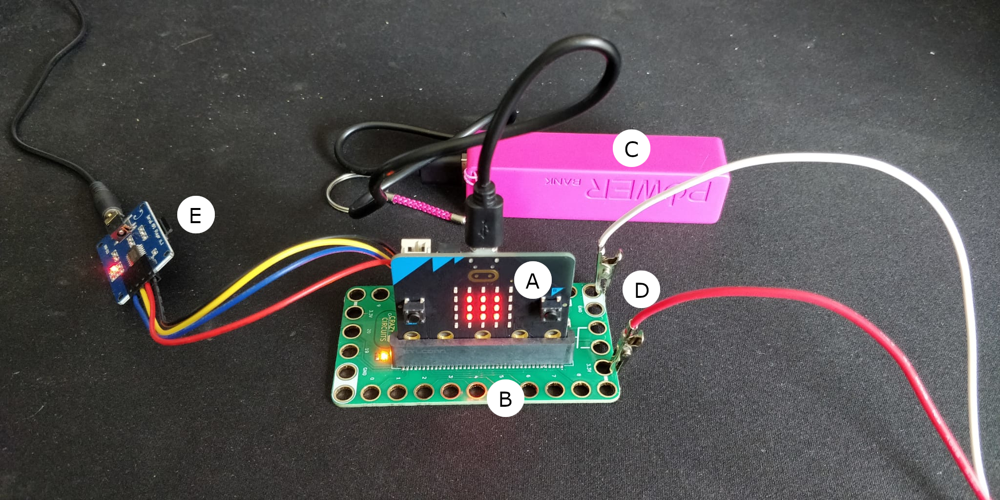

# JJC Hedon Hobbelpaart
Welkom op de JJC Hedon Hobbelpaart repo! Hier is een handleiding van het Paart, en tips hoe je het verder kan ontwikkelen. 

## Borrel ToDo List
- Opladen powerbank
- Opladen boxen
- Vraag Martin op de borrel om hem aan te sluiten

## Quicklinks
- [Microbit Editor met Code](https://makecode.microbit.org/_bDTKwM4hyDMW)
- [Inspiratie Bron MP3 Audio](https://learn.browndoggadgets.com/Guide/MP3+Audio+Player/334)

## Materiaal
- [Microbit v2](https://makecode.microbit.org/device/v2)
- [Bit Board Basic](https://www.browndoggadgets.com/products/crazy-circuits-bit-board)
- [MP3 Module](https://www.amazon.com/dp/B0725RHR4D?psc=1&ref=ppx_yo2ov_dt_b_product_details)

## Overzicht

### A: Microbit V2
De main brain achter alles. Hier staat de code op, en laat het paart hinniken. 

### B: Bit Board V1.0
De Microbit wordt hier in gepluggd. Dit geeft ons meer aansluitingen voor modules en onderdelen. 

### C: Powerbank
Deze powerbank geeft power aan alles. Dit heeft de volgende specs:
- Input: DC 5V-800mA
- Output DC 5V-1A
- Capacity: 1800mAh

Dit is belangrijk want module E moet genoeg power krijgen om te werken. 

### D: Aansluiting van de Hoorn.
De kabel van de lampjes van de hoorn zijn gesplit. Hierdoor kan het aangesloten worden op het zelfde systeem / batterij.

**Let op:**
- Rood => 3.5V
- Wit => Ground

### E: MP3 Module
De MP3 Module is met een aantal kabels vast aan de Bit Board (B). In de module zit ook een MicroSD kaart met een aantal audio bestanden (zie ook de `Audio` directory). De audio kabel gaat dan in de Boxen. 

Om de MicroSD Kaart uit te lezen zit er SD Adapater in het doosjes. Anders moet je een van [deze USB Readers](https://www.bol.com/nl/nl/p/micro-sd-kaart-lezer-usb-stick-micro-sd-card-reader-usb-2-0-tf-kaart-lezer-usb-stick-adapter/9200000079930641/) hebben. Martin heeft een er eentje die je wel kan lenen. 

Hoe dit allemaal werkt is vast gelegd in [deze blogpost](https://learn.browndoggadgets.com/Guide/MP3+Audio+Player/334). Onze implementatie veschilt een klein beetje. 

## Ideeën voor nieuwe modules/uitbreidingen
- Meer verschillende geluidjes
- Knopjes waar je op kan drukken
- Meer lampjes
- Bierkoeler
- Microfoon